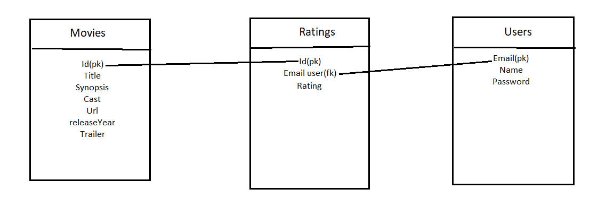

# getFlixProject

## - Presentation de l'équipe
1. Mycola Chernov (backend)
2. Nadia Akhtar (backend)
3. Shadhvi Veheysana Ramadoss (frontend)
4. Carolina León (frontend)

## - Description du projet
1. Nous avons crée un site de streaming ou l'on peut visualiser des films choisis dans la séléction proposée.

## - Technologies utilisées 
1. Vite js React
2. Typescript
3. Tailwind
4. Node.js
5. Mongo db

## - Source
1. rapidapi.com
2. youtube.com

## - Ce que l'utilisateur a besoin de savoir
1. L'utilisateur aura besoin d'installer des packages en utilisant la commande "npm install".

## - Voici l'avancé de notre projet
https://trello.com/b/ZbHAIHug/getflix-project

  

